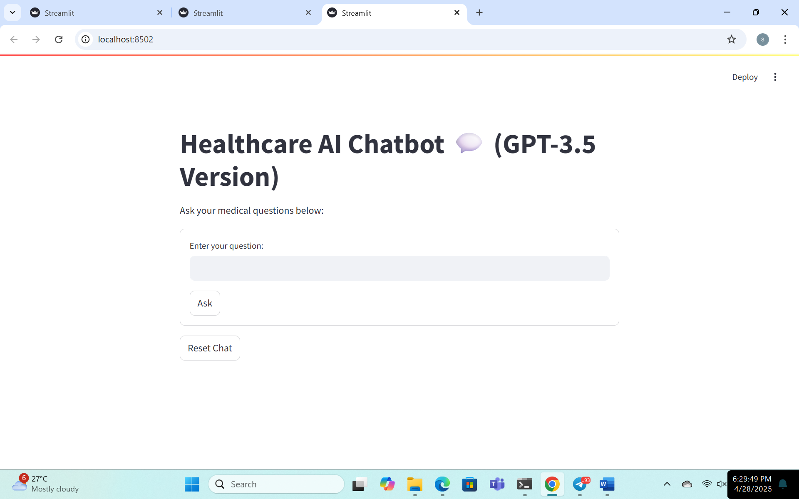
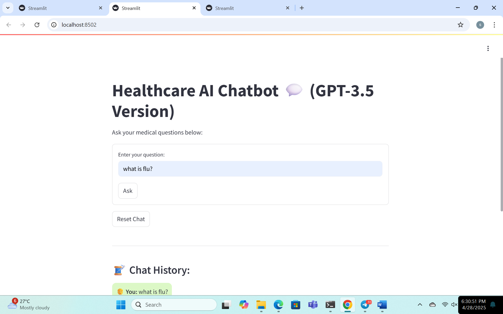
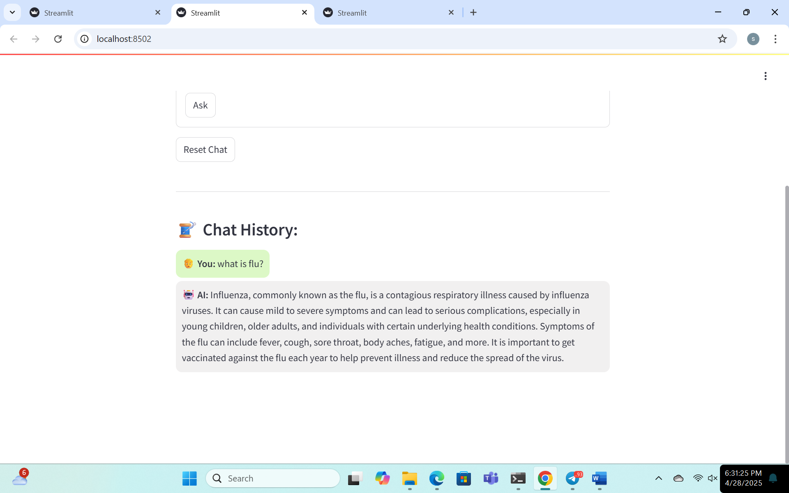

# Healthcare AI Chatbot 🩺🤖 (GPT-3.5 Version)

An AI-powered Healthcare Chatbot built using GPT-3.5 Turbo to answer medical questions.

---

## 🚀 Technologies Used
- Python 3
- OpenAI API (GPT-3.5 Turbo)
- Huggingface Transformers
- Streamlit
- Torch
- python-dotenv

---

## 📋 Project Structure
/src /chatbot_app.py # Frontend code for chatbot (Streamlit app) README.md requirements.txt .gitignore

---

## ⚙️ How to Run the App

1. Install dependencies:

```bash
pip install -r requirements.txt
2.Add your OpenAI API key to a .env file:
OPENAI_API_KEY=your_openai_key_here

3.Start the app:
streamlit run src/chatbot_app.py
---

---

## 📸 Demo Screenshots






